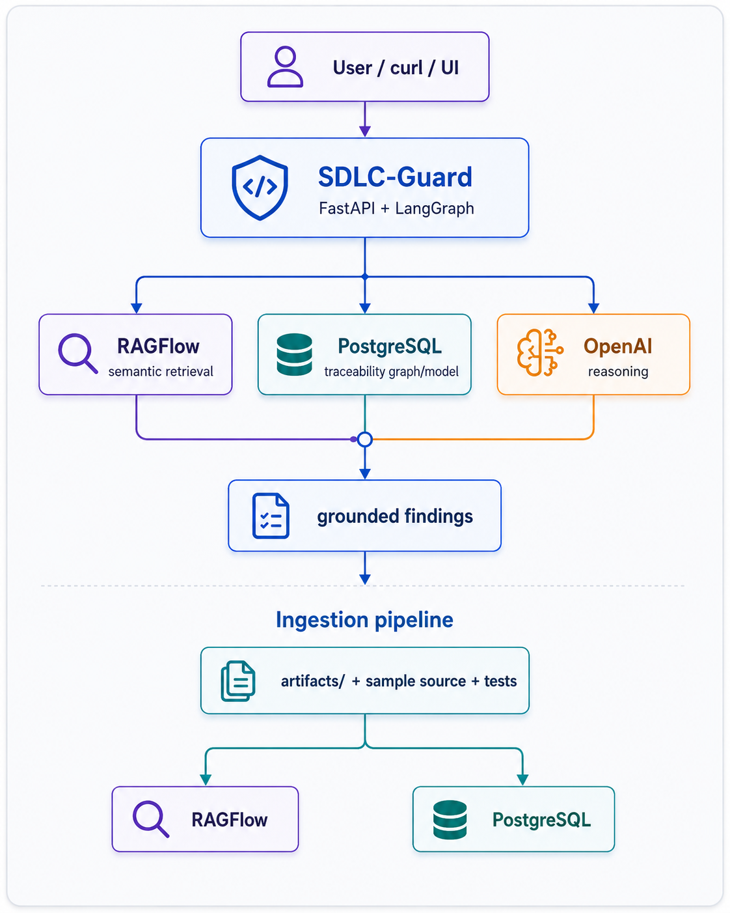
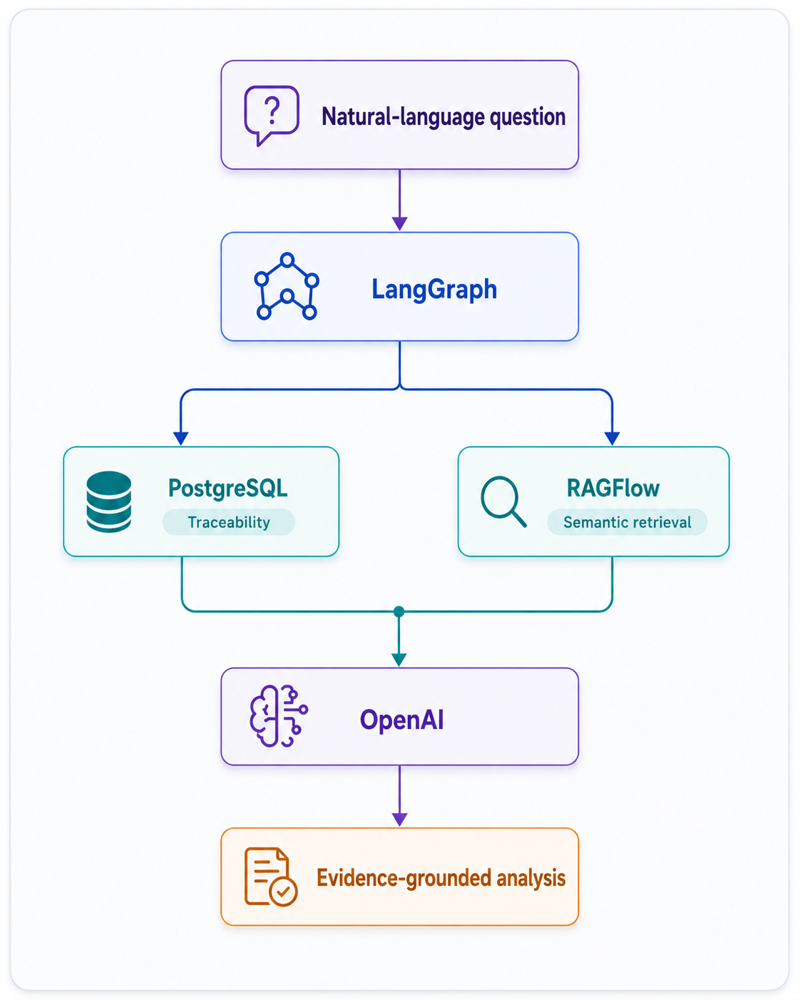

# SDLC-Guard
Maya is the Project Manager, Jack the Business Analyst, and Alex the Solution Architect on a large custom software program. The project started with a reasonably clear scope, but months later the reality looks very different. Requirements keep evolving, new acceptance criteria appear, technical decisions change, implementation gets ahead of documentation, tests lag behind, and technical debt slowly accumulates. Every week, the three of them spend more time trying to answer deceptively simple questions: What exactly is approved? What changed? What is still unclear? Which requirement has no implementation? Which implementation has no requirement? Are the tests still aligned with the current scope? And which parts of the solution are actually ready for release?

Alex starts asking a different question: What if the SDLC itself had a traceability and reasoning layer? A system that continuously connects business requirements, acceptance criteria, technical specifications, source code, tests, NFRs, and implementation evidence—and allows the team to interrogate the evolving project through natural language.

  

SDLC-Guard is an experimental architecture built around that idea. It combines deterministic traceability analysis with semantic retrieval and LLM reasoning. SDLC artifacts and connected source/test files are ingested into PostgreSQL and RAGFlow, while LangGraph orchestrates analysis of questions such as “Is checkout ready for release?”, “Which approved capabilities have no implementation?”, or “Is there source code that has no approved requirement?” It combines:

1. RAGFlow semantic retrieval for evidence discovery.
2. A PostgreSQL traceability store for deterministic completeness checks.
3. LangGraph orchestration for analysis workflows.
4. An OpenAI model for grounded reasoning and explanation.

The included demo project is a small e-commerce implementation with web frontend, backend business logic, wallet integration, and payment integration. The corpus is deliberately imperfect so the system has known scope gaps, implementation gaps, test gaps, orphan code, and contradictory requirements to discover.

## What SDLC-Guard can answer

Examples:

- Do you see inconsistencies in the current project scope?
- Are there gaps in the current project scope?
- What pieces are missing from checkout?
- Which approved functionality has no automated test?
- Which approved functionality has no source-code implementation?
- Is there code that does not map to approved scope?
- Which non-functional requirements lack verification?
- What would be affected if wallet payments were removed?
- Is checkout ready for release?

## Architecture

  

## Repository layout

- `services/sdlc-guard/` - FastAPI/LangGraph agent service.
- `services/sdlc-guard-ui/` - React/TypeScript conversational web UI.
- `artifacts/` - SDLC specifications and metadata imported into RAGFlow.
- `sample-project/ecommerce/` - runnable sample application source and tests.
- `k8s/base/` - Kubernetes manifests for SDLC-Guard, traceability DB, and sample app.
- `k8s/ragflow/` - RAGFlow Helm override values and installer notes.
- `scripts/` - build, image import, deployment, ingestion, and smoke-test helpers.
- `docs/` - architecture, known demo findings, and detailed deployment instructions.

## SDLC-Guard Web UI

SDLC-Guard includes a React/TypeScript browser interface for conversational analysis of SDLC artifacts.

The interface provides:

- Natural-language questions about project scope and release readiness
- Structured deterministic findings
- RAGFlow semantic evidence
- Artifact references and similarity scores
- Separate Analysis, Findings, and Evidence views

Example questions include:

- Is checkout ready for release?
- Do you see any inconsistencies in the current scope of the project?
- Are there any approved functionalities not covered by test implementation?
- Are there any functionalities that are not implemented at all and have no source code counterpart?
- Is there source code that has no approved requirement?
- Which non-functional requirements have not been verified?

## Why SDLC-Guard Is More Than RAG

SDLC-Guard combines deterministic SDLC traceability analysis with semantic retrieval and LLM reasoning.

  

### Deterministic traceability analysis

PostgreSQL stores explicit relationships between requirements, acceptance criteria, technical specifications, source code, tests, non-functional requirements, and observations.

This allows SDLC-Guard to deterministically identify structural issues such as:

- Missing source-code implementations
- Missing automated test coverage
- Requirement and specification conflicts
- Orphan source-code implementations
- Unverified non-functional requirements
- Release-readiness blockers

### Semantic evidence retrieval

RAGFlow retrieves relevant artifacts based on the meaning of the question rather than requiring the user to know exact artifact identifiers or keywords.

This allows SDLC-Guard to retrieve specifications, source-code artifacts, acceptance criteria, and tests that provide additional context for deterministic findings.

### Evidence-grounded reasoning

LangGraph orchestrates the deterministic traceability analysis and semantic retrieval workflow.

The LLM receives evidence from both sources and produces a natural-language explanation, supporting evidence, risk assessment, and remediation recommendations.

This hybrid architecture avoids relying on an LLM alone to determine structural SDLC facts.

## Known ground truth in the demo

The sample data intentionally contains these examples:

- Guest checkout is allowed by the business story but forbidden by a technical requirement.
- Wallet payments are specified as reserve-then-capture, while implementation performs immediate debit.
- Payment idempotency is required but not implemented.
- Partial refunds are approved but have no source-code implementation.
- Payment timeout handling is approved but has no automated test.
- A promotion-code implementation exists with no approved requirement.
- Checkout throughput is specified but has no performance test.
- Wallet failure auditing is required but has no automated verification.

See `docs/DEMO_GROUND_TRUTH.md` for the full expected result set.

## Quick start

See `docs/INSTALL_K8S.md` for the complete Ubuntu/Kubernetes procedure.

## Launch the Web UI

After SDLC-Guard and the UI are deployed to Kubernetes, start a local port-forward:

    kubectl -n sdlc-guard port-forward svc/sdlc-guard-ui 3000:80

Then open:

    http://localhost:3000

The UI sends questions to the existing SDLC-Guard `/api/v1/query` endpoint and presents the response as conversational analysis with structured Findings and Evidence views.

## Demo Project and Seeded Defects

The ecommerce application included in this repository is intentionally imperfect.

It contains deliberately seeded SDLC problems used to demonstrate SDLC-Guard's analysis capabilities, including:

- Conflicting business and technical requirements
- Missing source-code implementations
- Missing automated test coverage
- Incorrect wallet implementation semantics
- Missing payment idempotency
- Missing timeout reconciliation
- Missing partial refund functionality
- Unverified non-functional requirements
- Source code with no approved upstream requirement

These defects are intentional demonstration inputs and should not be interpreted as recommended implementation patterns.
